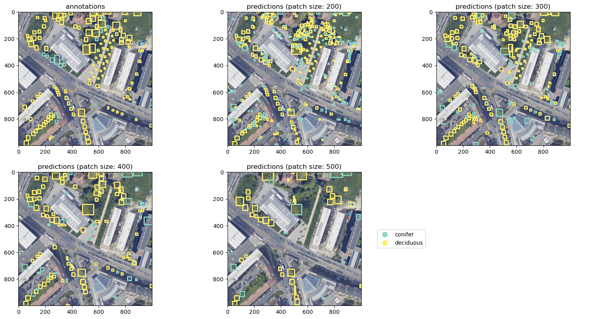

[](https://results.pre-commit.ci/latest/github/martibosch/swiss-urban-trees/main)
[](https://github.com/martibosch/swiss-urban-trees/blob/main/LICENSE)

# Swiss urban tree inventory

Urban tree crown detection and species identification from aerial imagery in Switzerland using deep learning.



*This repository is a draft/work in process, expect many changes/updates soon*.

## Example notebooks

- [Train/test split](https://github.com/martibosch/swiss-urban-trees/blob/main/notebooks/train-test-split.ipynb): using image descriptors and potentially tree inventories to select initial training tiles.
- [Train/fine-tune a model to predict tree crowns](https://github.com/martibosch/swiss-urban-trees/blob/main/notebooks/train-crown.ipynb): evaluate results of the [DeepForest](https://deepforest.readthedocs.io/en/latest) pre-trained model and fine-tune it with our annotations.
- [Multi species model](https://github.com/martibosch/swiss-urban-trees/blob/main/notebooks/multi-species-model.ipynb): train a model to predict tree species from the detected crowns.
- [LiDAR to tree crowns](https://github.com/martibosch/swiss-urban-trees/blob/main/notebooks/lidar-to-crown.ipynb): explore the use of LiDAR data to predict tree crowns/species to assist manual annotations or reduce the need for them.

## Instructions to reproduce

1. Create a conda environment:

```bash
snakemake -c1 create_environment
```

2. Activate it (if using conda, replace `mamba` for `conda`):

```bash
mamba activate swiss-urban-trees
```

3. Register the IPython kernel for Jupyter:

```bash
snakemake -c1 register_ipykernel
```

## Acknowledgments

- Based on the [cookiecutter-data-snake :snake:](https://github.com/martibosch/cookiecutter-data-snake) template for reproducible data science.
